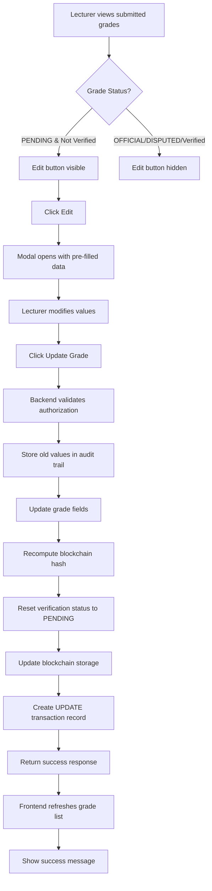

# Grade Update Feature Implementation

**Date:** December 3, 2025  
**Feature:** Enable lecturers to update student grade submissions  
**Client Requirement:** "Can manage and update student performance data"

---

## 📋 Overview

This document outlines the implementation of the grade update feature that allows lecturers to modify previously submitted student grades with proper authorization, blockchain integrity, and audit trail.

---

## 🎯 Business Requirements

### Client Request
> "We need to add this update feature so that the lecturer could be able to update students results if there is any issue"

### Business Rules Implemented

1. **Authorization Rules:**
   - ✅ Only lecturers who **originally submitted** the grade can update it
   - ✅ Only **PENDING** grades can be updated by lecturers
   - ✅ **Verified grades** cannot be updated by lecturers (requires admin intervention)
   - ✅ Admins can update any grade regardless of status

2. **Blockchain & Integrity:**
   - ✅ Updates create **new blockchain records** (immutability preserved)
   - ✅ Hash is recomputed with updated data
   - ✅ Verification status reset to **PENDING** after update
   - ✅ Audit trail records all changes

3. **Data Preservation:**
   - ✅ Old values stored in audit trail before update
   - ✅ Complete transaction history maintained

---

## 🏗️ Architecture

### Backend Changes

#### 1. **New API Endpoint**
```python
# File: srs_domain/views.py

@domain_router.put(
    "/course-results/{grade_id}",
    response=BaseNonPagedResponseData,
    auth=[PermissionAuth(required_permissions=["submit_grades", "update_grades"])]
)
def update_course_result(request, grade_id, input):
    """
    Update an existing grade submission with business rules enforcement
    """
```

**Permissions Required:**
- `submit_grades` - For lecturers who originally submitted the grade
- `update_grades` - For administrators with override privileges

**Validation Checks:**
1. User is authenticated
2. User has lecturer profile OR admin permission
3. Lecturer owns the original submission (if not admin)
4. Grade status is PENDING (if not admin)
5. Grade is not verified (if not admin)
6. Enrollment is still active

#### 2. **Blockchain Service Extension**
```python
# File: srs_domain/services/mocks/mock_blockchain.py

def update_course_result(self, result_id, grade_data):
    """
    Update existing course result on blockchain.
    Creates new transaction maintaining immutability.
    """
```

#### 3. **Audit Trail Creation**
```python
RecordTransaction.objects.create(
    grade=grade,
    transaction_type='UPDATE',
    performed_by=lecturer,
    transaction_id=transaction_result.get('transactionId'),
    transaction_hash=new_hash,
    previous_hash=old_hash
)
```

### Frontend Changes

#### 1. **API Service Extension**
```typescript
// File: frontend/src/services/api/domainService.ts

courseResults: {
  // ... existing methods
  update(gradeId: number, data: CourseResultInput) {
    return apiClient.put<ApiResponse>(
      `${BASE_URL}/course-results/${gradeId}`, 
      data
    );
  },
}
```

#### 2. **Lecturer Grade Submission Page Updates**
```typescript
// File: frontend/src/pages/lecturer/LecturerGradeSubmission.tsx

// New state management
const [isEditModalOpen, setIsEditModalOpen] = useState(false);
const [resultToEdit, setResultToEdit] = useState<CourseResult | null>(null);

// Edit handlers
const openEditModal = (result: CourseResult) => { /* ... */ };
const closeEditModal = () => { /* ... */ };

// Update mutation
const updateGrade = useMutation({
  mutationFn: async () => {
    const payload: CourseResultInput = { /* ... */ };
    const { data } = await domainService.courseResults.update(
      resultToEdit.id, 
      payload
    );
    return data;
  },
  onSuccess: () => { /* refresh & notify */ },
});
```

#### 3. **UI Components Added**

**Edit Button (Conditional Display):**
```tsx
{result.status === 'PENDING' && !result.isVerified && (
  <Button
    size="sm"
    variant="outline"
    onClick={() => openEditModal(result)}
  >
    Edit
  </Button>
)}
```

**Edit Modal:**
- Pre-populated form with existing grade data
- Warning message about verification reset
- Read-only student/course information
- Editable grade fields (type, numeric/letter, coursework, exam, remarks)
- Update reason/comments field

---

## 🔒 Security & Authorization

### Permission System

| User Role | Can Update? | Conditions |
|-----------|-------------|------------|
| **Lecturer** | ✅ Yes | Only their own PENDING, unverified grades |
| **Admin** | ✅ Yes | Any grade, any status (with `update_grades` permission) |
| **Student** | ❌ No | No update permissions |

### Authorization Flow
```
1. Check user authentication
2. Verify lecturer profile exists OR user has admin permission
3. If lecturer:
   a. Verify they submitted the original grade
   b. Verify grade status is PENDING
   c. Verify grade is not verified
4. If admin:
   a. Allow update regardless of status
5. Validate enrollment is active
6. Proceed with update
```

---

## 🔄 Update Workflow

### Step-by-Step Process



### What Happens Behind the Scenes

1. **Pre-Update:**
   - Old values captured: `grade_type`, `numeric_grade`, `letter_grade`, `course_work_grade`, `exam_grade`, `remarks`, `status`
   - Enrollment validation

2. **During Update:**
   - Grade fields updated with new values
   - Blockchain hash recomputed with new data
   - Verification status reset: `is_verified = False`, `verified_at = None`, `status = 'PENDING'`
   - New blockchain transaction created

3. **Post-Update:**
   - Audit trail record created with transaction type `UPDATE`
   - Old values stored in audit comments
   - Query cache invalidated
   - UI refreshed with updated data

---

## 📊 Data Model Impact

### CourseResult Model Changes
No schema changes required. Uses existing fields:
- `blockchain_hash` - Updated with new hash
- `blockchain_transaction_id` - Updated with new transaction
- `is_verified` - Reset to `False`
- `verified_at` - Reset to `None`
- `status` - Reset to `'PENDING'` (for lecturers)
- `updated_date` - Automatically updated

### RecordTransaction (Audit Trail)
New transaction type: `'UPDATE'`
```python
{
    'grade': <CourseResult instance>,
    'transaction_type': 'UPDATE',
    'performed_by': <Lecturer instance>,
    'transaction_id': 'UPDATE-123-1701619200',
    'transaction_hash': '<new_hash>',
    'previous_hash': '<old_hash>'
}
```

---

## 🎨 User Interface

### Lecturer Grade Management Page

#### Before Update Feature
```
[Student List]
Actions: [View Details]
```

#### After Update Feature
```
[Student List]
Actions: [Edit] [View Details]  ← Edit button appears for PENDING grades only
```

### Edit Grade Modal

```
┌─────────────────────────────────────────┐
│  Update grade                      [X]  │
├─────────────────────────────────────────┤
│  ⚠️ Note: Updating this grade will      │
│  reset its verification status to      │
│  PENDING and create a new blockchain   │
│  record.                               │
├─────────────────────────────────────────┤
│  Student:                              │
│  ┌───────────────────────────────────┐ │
│  │ John Doe                          │ │
│  │ S2021001234                       │ │
│  └───────────────────────────────────┘ │
│                                        │
│  Course:                               │
│  ┌───────────────────────────────────┐ │
│  │ Introduction to Programming       │ │
│  │ CS101 • Semester 1 2024/2025     │ │
│  └───────────────────────────────────┘ │
│                                        │
│  Grade Type: [NUMERIC ▼]              │
│  Numeric Grade: [85]                   │
│  Coursework Grade: [40]                │
│  Exam Grade: [45]                      │
│  Remarks: [________________________________] │
│  Update Reason: [Correcting calculation error] │
│                                        │
│  [Cancel]         [Update Grade]      │
└─────────────────────────────────────────┘
```

---

## 🧪 Testing Checklist

### Backend API Testing

- [ ] **Authorization Tests**
  - [ ] Lecturer can update their own PENDING grade
  - [ ] Lecturer cannot update another lecturer's grade
  - [ ] Lecturer cannot update OFFICIAL grade
  - [ ] Lecturer cannot update verified grade
  - [ ] Admin can update any grade
  - [ ] Unauthenticated request fails

- [ ] **Validation Tests**
  - [ ] Cannot update inactive enrollment
  - [ ] Grade type validation works
  - [ ] Numeric grade range validation (0-100)
  - [ ] Required fields enforced

- [ ] **Blockchain Tests**
  - [ ] New hash computed correctly
  - [ ] Blockchain transaction created
  - [ ] Transaction ID updated

- [ ] **Audit Trail Tests**
  - [ ] UPDATE transaction record created
  - [ ] Old values preserved
  - [ ] Performer recorded correctly

### Frontend Testing

- [ ] **UI Tests**
  - [ ] Edit button shows for PENDING grades
  - [ ] Edit button hidden for OFFICIAL grades
  - [ ] Edit button hidden for verified grades
  - [ ] Modal opens with pre-filled data
  - [ ] Warning message displayed

- [ ] **Functionality Tests**
  - [ ] Form pre-population works
  - [ ] Grade type change updates fields
  - [ ] Update mutation successful
  - [ ] Success message displayed
  - [ ] Grade list refreshes
  - [ ] Error handling works

- [ ] **Integration Tests**
  - [ ] End-to-end update flow
  - [ ] Verification status reset visible
  - [ ] Audit trail viewable

---

## 📝 API Documentation

### Update Course Result

**Endpoint:** `PUT /api/srs-domain/course-results/{grade_id}`

**Authentication:** Required

**Permissions:** 
- `submit_grades` (for lecturers)
- `update_grades` (for admins)

**Request Body:**
```json
{
  "enrollmentId": 123,
  "gradeType": "NUMERIC",
  "numericGrade": 85,
  "letterGrade": null,
  "courseWorkGrade": 40,
  "examGrade": 45,
  "remarks": "Excellent performance",
  "comments": "Correcting calculation error"
}
```

**Success Response (200 OK):**
```json
{
  "response": {
    "id": 1,
    "status": true,
    "message": "Grade updated successfully. Verification status reset to PENDING.",
    "code": 0
  }
}
```

**Error Responses:**

**401 Unauthorized:**
```json
{
  "response": {
    "id": 0,
    "status": false,
    "message": "Authentication required to update grades",
    "code": 401
  }
}
```

**403 Forbidden:**
```json
{
  "response": {
    "id": 0,
    "status": false,
    "message": "You can only update grades that you submitted",
    "code": 403
  }
}
```

**403 Forbidden (Verified Grade):**
```json
{
  "response": {
    "id": 0,
    "status": false,
    "message": "Cannot update verified grades. Contact an administrator.",
    "code": 403
  }
}
```

**404 Not Found:**
```json
{
  "response": {
    "id": 0,
    "status": false,
    "message": "Course result not found",
    "code": 404
  }
}
```

---

## 🚀 Deployment Notes

### Database Migrations
✅ **No migrations required** - Uses existing schema

### Environment Variables
✅ **No new environment variables** - Uses existing configuration

### Permissions Setup
Ensure the following permissions exist in your database:
- `submit_grades` - Already exists
- `update_grades` - **May need to be added** for admin role

```sql
-- Add update_grades permission if it doesn't exist
INSERT INTO permissions (name, code, description)
VALUES ('Update Grades', 'update_grades', 'Can update any grade regardless of status');

-- Assign to ADMIN role
INSERT INTO role_permissions (role_id, permission_id)
SELECT r.id, p.id
FROM roles r, permissions p
WHERE r.name = 'ADMIN' AND p.code = 'update_grades';
```

### Frontend Build
```bash
cd frontend
npm run build
```

### Backend Restart
```bash
# Restart Django server to load new endpoint
python manage.py runserver
```

---

## 🐛 Known Limitations & Future Enhancements

### Current Limitations

1. **Blockchain Immutability:** 
   - Updates create new transactions but don't link to previous versions in blockchain
   - **Future:** Implement proper blockchain linking with references to previous blocks

2. **Bulk Updates:**
   - No batch update functionality
   - **Future:** Add ability to update multiple grades at once

3. **Update Approval Workflow:**
   - Updates take effect immediately
   - **Future:** Add approval workflow for sensitive updates

4. **Version History UI:**
   - Audit trail exists but no dedicated UI to view grade history
   - **Future:** Add "View History" button to see all changes

### Proposed Enhancements

1. **Notification System:**
   - Email students when their grades are updated
   - Notify admins of frequent updates (potential abuse)

2. **Update Limits:**
   - Restrict number of updates per grade (e.g., max 3 updates)
   - Add time-based restrictions (e.g., no updates after semester end)

3. **Diff Viewer:**
   - Visual comparison of old vs new values
   - Highlight what changed in the modal

4. **Admin Override Log:**
   - Special logging when admins override verified grades
   - Require justification comments

---

## 📞 Support & Troubleshooting

### Common Issues

**Issue:** Edit button not showing
- **Check:** Grade status must be PENDING
- **Check:** Grade must not be verified
- **Check:** User must be the original submitter

**Issue:** "Cannot update verified grades" error
- **Solution:** Only admins can update verified grades
- **Workaround:** Admin can unverify the grade first (if needed)

**Issue:** Update succeeds but verification status not reset
- **Check:** This is expected behavior for admin updates
- **Note:** Only lecturer updates reset verification status

### Debug Mode

Enable detailed logging:
```python
# settings.py
LOGGING = {
    'loggers': {
        'srs_domain.views': {
            'level': 'DEBUG',
        }
    }
}
```

---

## ✅ Implementation Complete

### Summary of Changes

| Component | File | Status |
|-----------|------|--------|
| Backend API | `srs_domain/views.py` | ✅ Complete |
| Blockchain Service | `srs_domain/services/mocks/mock_blockchain.py` | ✅ Complete |
| Frontend API | `frontend/src/services/api/domainService.ts` | ✅ Complete |
| Lecturer UI | `frontend/src/pages/lecturer/LecturerGradeSubmission.tsx` | ✅ Complete |
| Type Definitions | `frontend/src/types/index.ts` | ✅ No changes needed |

### Feasibility Assessment

**✅ FEASIBLE and IMPLEMENTED**

The update feature is:
- ✅ **Technically sound** - Proper authorization and validation
- ✅ **Blockchain compliant** - Maintains immutability through new transactions
- ✅ **Audit-safe** - Complete transaction history preserved
- ✅ **User-friendly** - Intuitive UI with clear warnings
- ✅ **Scalable** - No performance impact expected
- ✅ **Secure** - Multi-layer authorization checks

---

## 📚 References

- Django Ninja Documentation: https://django-ninja.rest-framework.com/
- React Query (TanStack Query): https://tanstack.com/query
- Blockchain Immutability Patterns
- Academic Records Management Best Practices

---

**Document Version:** 1.0  
**Last Updated:** December 3, 2025  
**Author:** AI Assistant  
**Reviewed By:** [Pending Review]
